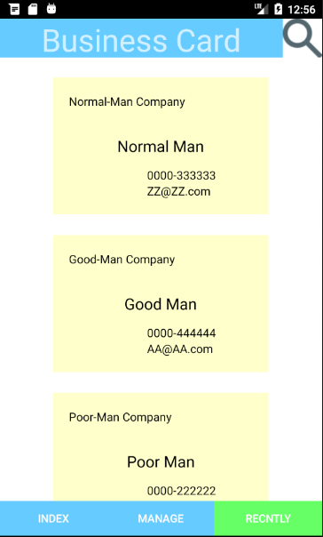
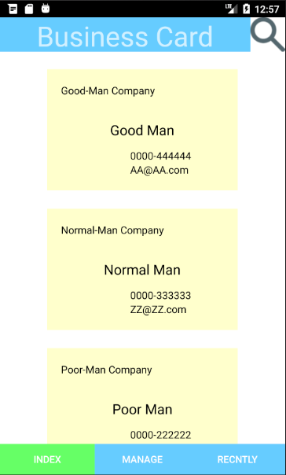
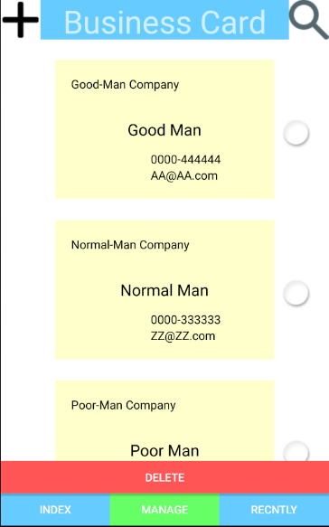
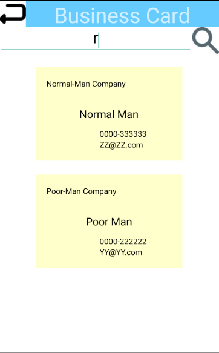
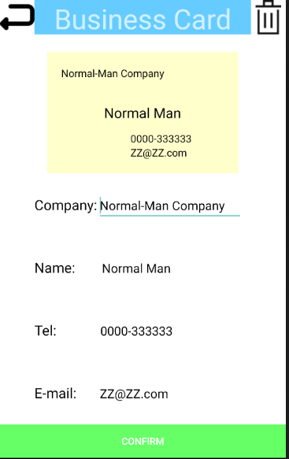

# BusinessCardManager
The Business Card Manage System can help us to manage the business card.
In this app, you can input the information of your business card and manage it easily.
You can find the business card by recently used, index and search by keyword.
You can change all the information of all the business card.
You can manage not only one business card but also many business cards in one time.

In the Recently and Index page, the business cards show in recently used order and name order.
You can click one of the business card and enter the detail page.
You can also click the search button and enter the search page.

In the Manage page, you can select multiple business card and delete them.
You can click the add button, enter the detail page and input the information to add a new business card.

In the search page, you can search the business card you want by enter the keyword.
When you find the business card you want, you can click it and enter the detail page.

In the detail page, you can find the information of the business card and modify it.
If you open a vacant detail page by click the add button in the manage page, you can input the information of the new card and input it into the system.
When you finish your edit, click the confirm button to confirm the changing or adding.

